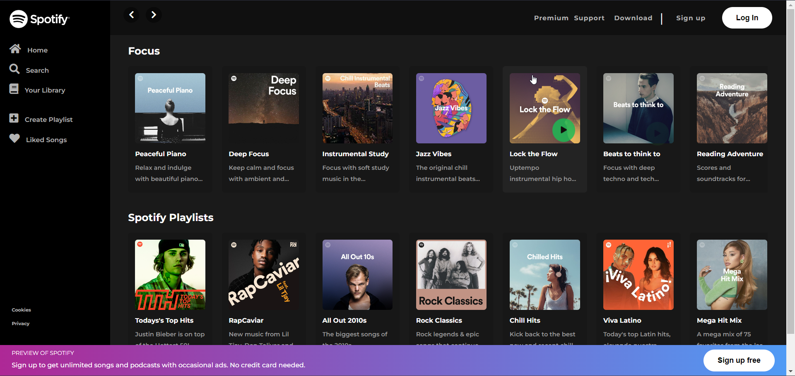

# Spotify Clone

This is a Spotify clone created using HTML and CSS. The clone aims to replicate Spotify.

## Technologies Used

- HTML
- CSS

## Getting Started

To get started with this project, simply clone the repository and open the `index.html` file in your web browser.

git clone https://github.com/Kaushallrai/Cloned-Projects.git
 
cd Cloned_projects/spotify-clone
 
open index.html

## Screenshot

## Contributing

If you'd like to contribute to the Spotify clone, please open an issue or submit a pull request on the repository.

## Credits

- The Spotify logo and images used in this project are the property of Spotify.
