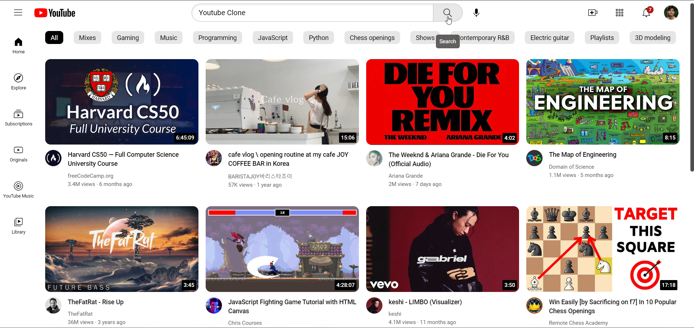

# YouTube Clone

This is a YouTube clone created using HTML and CSS. The clone aims to replicate YouTube. It is not functional, but it is designed to be responsive and adapt to different screen sizes.

## Technologies Used

- HTML
- CSS

## Getting Started

To get started with this project, simply clone the repository and open the `index.html` file in your web browser.

git clone https://github.com/Kaushallrai/Cloned-Projects.git
 
cd Cloned_projects/Youtube_clone
 
open index.html

## Screenshot

## Contributing

This project is not intended for external contributions. It was created as a learning exercise and is not functional.

If you'd like to contribute to the Youtube clone, please open an issue or submit a pull request on the repository.

## Credits

- The Youtube logo and images used in this project are the property of Youtube.
